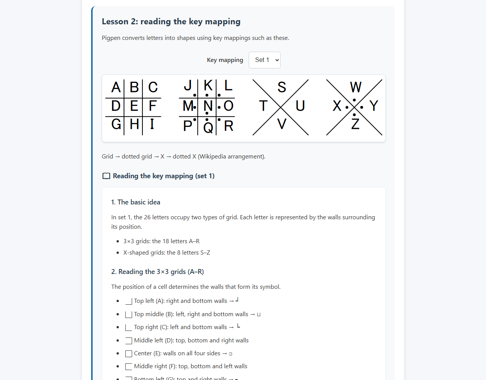
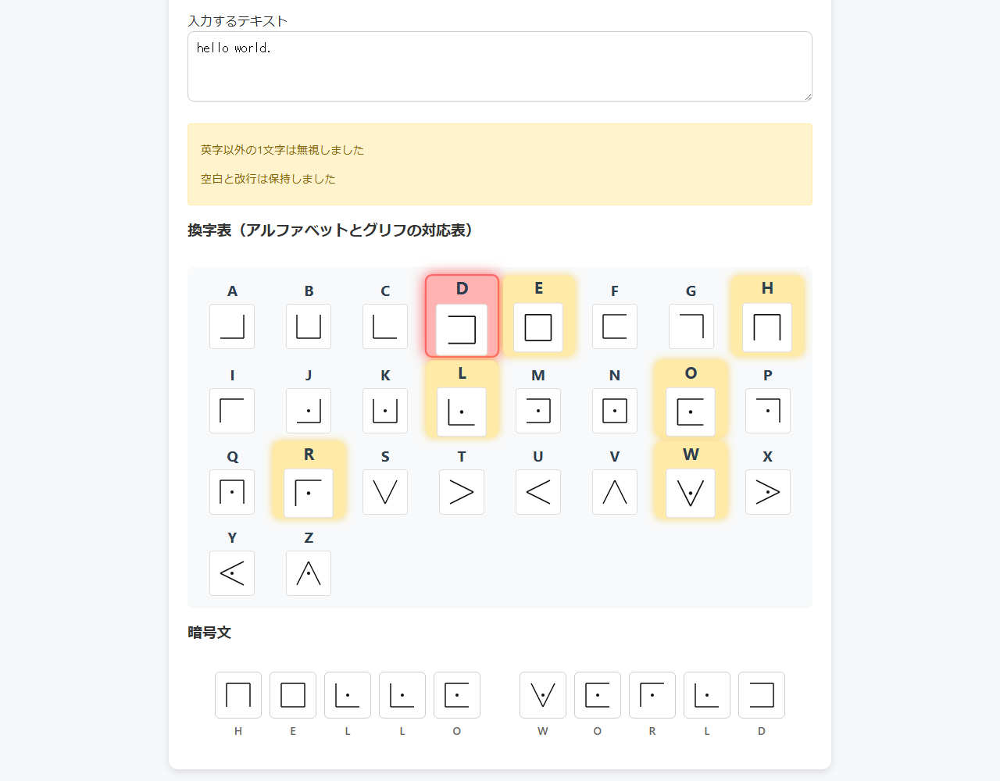
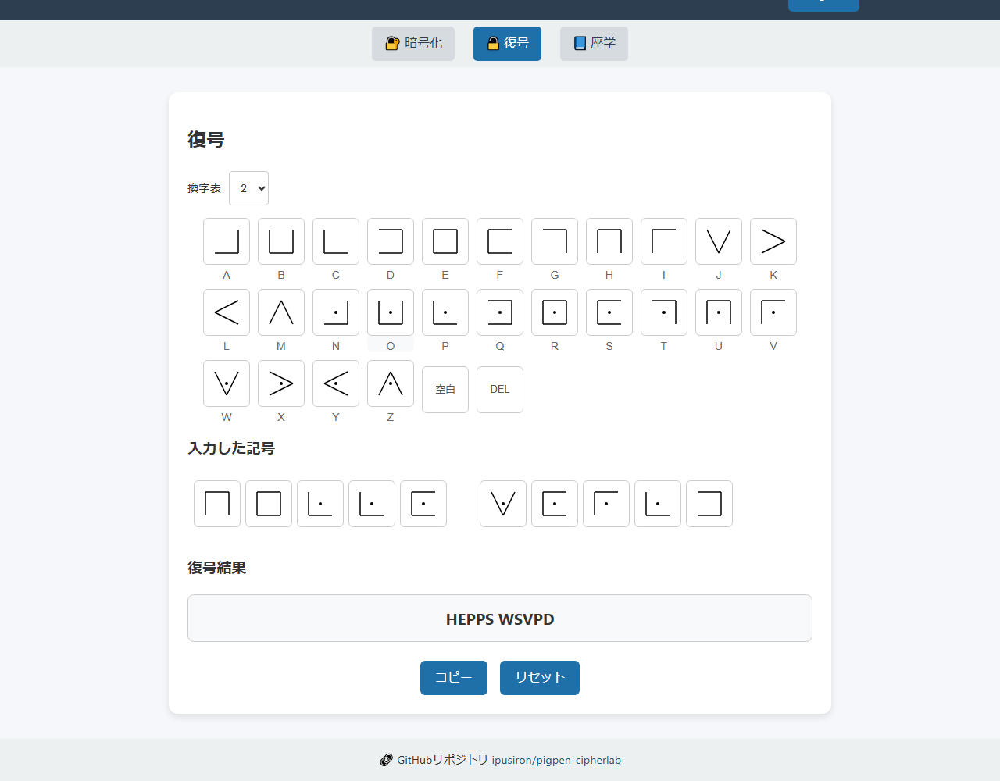
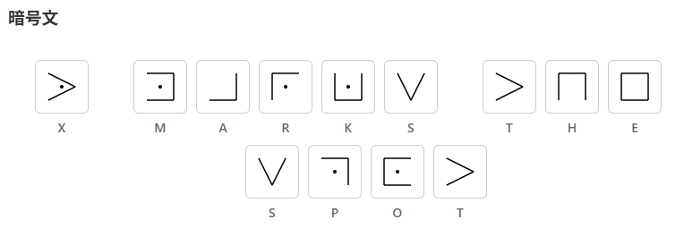

English · [日本語](README.md)

# Pigpen CipherLab - Visual Learning Tool for the Pigpen Cipher


[](https://ipusiron.github.io/pigpen-cipherlab/)

**Day032 - 100 Security Tools with Generative AI**

Pigpen CipherLab is a web tool for seeing, exploring and learning the classical Pigpen cipher.
Three tabs—Encrypt, Decrypt and Learn—provide an interactive view of three synchronized key mappings.

---

## 🌐 Demo

[Open Pigpen CipherLab](https://ipusiron.github.io/pigpen-cipherlab/)

---

## 📸 Screenshots



*English Learn tab: lesson 2, the set 1 key mapping and the start of the reading guide with symbol images.*



*Japanese Encrypt tab: set 1, Preserve whitespace, input hello world. The highlighted reference and both warnings are visible.*



*Japanese Decrypt tab: enter HELLO WORLD with set 1, then choose set 2 to read the same symbols as HEPPS WSVPD.*

---

## ✨ Features

### 📱 Tabs

| Tab | Purpose |
|---|---|
| 🔐 Encrypt | Convert text into Pigpen glyphs immediately, with letter highlighting |
| 🔓 Decrypt | Enter a symbol sequence and reread it with the selected key mapping; copy the result |
| 📘 Learn | Study the history, structure and cryptanalysis of the cipher |

### 🔐 Encrypt tab

- Live encryption as you type
- Visual reference for letters and their glyphs
- Used letters highlighted in yellow; the last letter highlighted in red
- Ignore or preserve whitespace
- Three different key mappings
- Warnings showing ignored characters and whitespace handling

### 🔓 Decrypt tab

- Clickable, keyboard-accessible glyph buttons that append symbol IDs
- Letter labels beneath each glyph
- A Space button to enter a space
- DEL to remove the final symbol
- Copy for the decoded result
- Success and failure feedback through a visible toast and a live region
- Reset to clear the symbol sequence and result

### 📘 Learn tab

- Lesson 1: history and basic concepts
- Lesson 2: key mappings
  - 3×3 and X-shaped grid structures
  - The relationship between positions and shapes
  - Distinguishing letters by dots
  - A worked HELLO example
- Lesson 3: cryptanalysis tips
  - Treating Pigpen as a monoalphabetic substitution cipher
  - Frequency analysis
  - Pattern recognition
  - Practical steps and techniques
  - Reference English letter frequencies

### 🛠 Shared features

- All three key selectors, reference glyphs, ciphertext, decoding keys and text, and learning diagrams update together
- Responsive layouts for phones, tablets and desktops
- Help from the ❓ button
- Escape to close help
- ARIA tabs with arrow-key navigation, symbol buttons, result live regions and managed help focus
- Japanese and English interfaces without losing the current input or symbols

---

## 📖 Usage

1. In Encrypt, choose a key mapping and enter hello world.
2. Choose Preserve and inspect the highlights, warnings and ciphertext.
3. In Decrypt, enter HELLO WORLD using set 1, then switch to set 2. The same symbols now read HEPPS WSVPD.
4. Use Learn to compare diagrams and notes for each key mapping.

There is no separate Encrypt button: conversion happens as you type. Whitespace-only input follows the selected mode.
Switching mappings keeps the symbol sequence; symbols absent from the selected mapping are shown as ?.
Space, DEL, Copy and Reset also work from the keyboard. Tab stays within help; Escape or a click on the backdrop closes it.

The header button switches languages. Language priority is URL `?lang=ja|en`, saved preference, then browser language.
Switching languages keeps the active tab, key mapping, whitespace mode, text and symbol sequence.
Open `index.html` directly with file:// or serve the folder over local HTTP.

---

## 🧠 What Is the Pigpen Cipher?

The Pigpen cipher replaces alphabetic letters with geometric symbols taken from grid cells. It is a monoalphabetic substitution cipher.

The name combines pig and pen, an enclosure for pigs. The three-by-three grids resemble the enclosures used to keep pigs.
It is pronounced “pigpen”; the Japanese spelling is ピッグペン.

### Also called the Freemason cipher

The Freemasons are said to have used it from the early 18th century for private communication and records.
The Rosicrucian cipher is another Pigpen variant. The version described on Wikipedia distinguishes letters by dot position (left, middle, right), whereas this tool's set 3 uses the number of dots (1–3).

The symbols, called glyphs in this tool, can look geometric or decorative. They may be mistaken for decoration rather than recognized as ciphertext.

### Variants

Variants may change the glyph shapes or the arrangement of letters in the key mapping.
This tool provides three arrangements.

| Key mapping | Features | Source |
|---|---|---|
| Set 1 | Grid → dotted grid → X → dotted X | [Wikipedia: Pigpen cipher](https://en.wikipedia.org/wiki/Pigpen_cipher) |
| Set 2 | Grid → X → dotted grid → dotted X | 『暗号解読 実践ガイド』p. 438 (Japanese-language book) |
| Set 3 | Three letters per cell of a nine-cell grid, distinguished by 1–3 dots | 『暗号の秘密』p. 62 (Japanese-language book) |

### Cryptographic strength

Pigpen is a monoalphabetic substitution cipher: one plaintext letter corresponds to one ciphertext symbol.
There is one substitution table for a given mapping.

| | Alphabet | Unit |
|---|---|---|
| Plaintext | Alphabetic letters | One letter |
| Ciphertext | Glyphs: geometric shapes made of walls and dots | One glyph |

---

## 🔬 Specification and Known Answers

A symbol ID is `g:<walls>:<dot count>` or `x:<region>:<dot count>`.
Grid walls are listed in top T, right R, bottom B, left L order. X regions are top T, left L, right R and bottom B.
For example, `g:RB:0` has right and bottom walls and no dots; `x:T:0` is the top region, shaped like V.

Input is normalized with NFKD, combining marks are removed, and letters are uppercased.
Fullwidth hello becomes HELLO; straße becomes STRASSE; café becomes CAFE.
Preserve keeps line feeds as line breaks and treats tabs, fullwidth spaces and NBSP as spaces. Ignore removes all whitespace.
Characters other than letters and whitespace are discarded and counted in a warning. They never become image paths.

| Key mapping | Plaintext | Symbol IDs |
|---|---|---|
| 1 | `X marks the spot` | `X=x:L:1 M=g:TRB:1 A=g:RB:0 R=g:TL:1 K=g:RBL:1 S=x:T:0 T=x:L:0 H=g:TRL:0 E=g:TRBL:0 S=x:T:0 P=g:TR:1 O=g:TBL:1 T=x:L:0` |
| 1 | `HELLO` | `H=g:TRL:0 E=g:TRBL:0 L=g:BL:1 L=g:BL:1 O=g:TBL:1` |
| 2 | `HELLO` | `H=g:TRL:0 E=g:TRBL:0 L=x:R:0 L=x:R:0 O=g:RBL:1` |
| 3 | `HELLO` | `H=g:BL:2 E=g:RBL:2 L=g:TRB:3 L=g:TRB:3 O=g:TRBL:3` |

Each mapping has 26 distinct symbols, for a total of 78 glyph files.
Sets 1 and 2 are permutations of the same 26 symbols. HELLO WORLD entered with set 1 reads HEPPS WSVPD with set 2.
Nine symbols in set 3 also occur in set 1. Reading the same set 1 sequence with set 3 yields ??GGP ?PYG?.

---

## 🔤 Encryption Example

The phrase “X marks the spot” encrypted with set 1 looks like this:



*“X marks the spot” encrypted with set 1.*

This is also the example in [Wikipedia's Pigpen cipher article](https://en.wikipedia.org/wiki/Pigpen_cipher); the ciphertext matches.

---

## 🔍 How to Break a Pigpen Ciphertext

1. Extract the distinct symbols from the ciphertext, list them, and count their occurrences.
2. Assign a letter to each symbol. This converts the puzzle into a monoalphabetic substitution cipher over letters.
3. Apply guesses, dictionary-based approaches and frequency analysis.

---

## 📚 References

### Books involving the author

- [『暗号解読 実践ガイド』](https://akademeia.info/?page_id=39995) (Japanese-language book)
    - p. 34: Pigpen ciphertext on an NSA mug
    - pp. 34–35: Pigpen ciphertext on a New York gravestone
    - p. 83: Pigpen ciphertext solved by Andre Langie
    - p. 438: a variant in the index, corresponding to set 2 in this tool

### Tools by the author

- [Hill-climbing solver for monoalphabetic substitution ciphers](https://github.com/ipusiron/cipherclimb)

---

## 🔒 Security of This Tool

The CSP allows only same-origin scripts and styles, with no inline execution.
The interface uses DOM construction and textContent; input is not interpreted as HTML.
There are no external APIs, CDNs, fonts or dependencies, and interaction generates no external requests.
External links open only when you choose them.

Only the language preference, under `pigpen-language`, is stored in localStorage. The tool also works when storage is blocked.
Plaintext and ciphertext are neither stored nor transmitted. Pigpen itself is for education, not protection of confidential information.

---

## 🧪 Tests

Run `npm test` with Node.js 22. No dependency installation is needed.
GitHub Actions runs the same tests on push and pull_request.

| File | Coverage |
|---|---|
| core.test.js | Three mappings, normalization, encryption, rereading, lines and dots of all 78 SVGs |
| core2.test.js | Drawing coordinates, keyword tables, variant ranking and exercise known answers |
| html.test.js | CSP, ARIA, labels and prohibited DOM operations |
| i18n.test.js | Matching dictionary keys and placeholders; untranslated Japanese literals |
| contrast.test.js | Eight CSS-variable pairs at or above 4.5:1 |
| format.test.js | Maximum line lengths and minimum line counts |
| readme.test.js | Recompute four known-answer rows; 15 matched sections, trees, images and YAML |

---

## 📁 Directory Structure

```text
pigpen-cipherlab/                 # Project root
├── .github/                      # GitHub configuration
│   └── workflows/                # GitHub Actions workflows
│       └── test.yml              # Run npm test on push and pull_request
├── assets/                       # Images
│   ├── en/                       # English screenshots
│   │   └── screenshot.png        # Learn tab: reading set 1
│   ├── glyphs/                   # Glyph images by key mapping
│   │   ├── 1/                    # Set 1: Wikipedia arrangement
│   │   │   ├── A.svg〜Z.svg      # Letter glyphs (26 files)
│   │   │   └── key_mapping.svg   # Key mapping diagram
│   │   ├── 2/                    # Set 2: Practical Guide to Cryptanalysis, p. 438
│   │   │   ├── A.svg〜Z.svg      # Letter glyphs (26 files)
│   │   │   └── key_mapping.svg   # Key mapping diagram
│   │   └── 3/                    # Set 3: Secrets of Cryptography, p. 62
│   │       ├── A.svg〜Z.svg      # Letter glyphs (26 files)
│   │       └── key_mapping.svg   # Key mapping diagram
│   ├── ciphertext.png            # README example: X marks the spot
│   ├── screenshot.png            # Encrypt tab: hello world.
│   └── screenshot2.png           # Decrypt tab: rereading the symbols with set 2
├── js/                           # Scripts separated from the UI
│   ├── i18n.js                   # Japanese/English dictionaries and language selection
│   └── pigpen-core.js            # Pure symbol model, normalization, encryption and rereading
├── test/                         # Automated tests (node --test)
│   ├── contrast.test.js          # Color contrast ratios
│   ├── core.test.js              # Known answers and shapes of all 78 glyphs
│   ├── core2.test.js             # Extension known answers and 78 drawing geometries
│   ├── format.test.js            # Maximum line lengths and minimum line counts
│   ├── html.test.js              # CSP, ARIA and prohibited patterns
│   ├── i18n.test.js              # Dictionary keys and untranslated Japanese literals
│   └── readme.test.js            # Known answers, README structure and images
├── .gitignore                    # Files excluded from Git
├── .nojekyll                     # Disable Jekyll on GitHub Pages
├── CLAUDE.md                     # Guidance for Claude Code
├── LICENSE                       # MIT license
├── README.en.md                  # English documentation
├── README.md                     # Japanese documentation
├── index.html                    # Three-tab interface
├── package.json                  # npm test configuration (no dependencies)
├── script.js                     # State and UI rendering
└── style.css                     # Styles
```

---

## 💻 Requirements

Intended for current Chrome, Edge, Firefox and Safari versions supporting Unicode normalization and dialog.
Both HTTP and file:// are supported. Copy succeeds when the Clipboard API is available; otherwise, a message explains the failure.
Automated verification uses Python Playwright and Chromium. Real phones and other browsers have not been verified.

---

## 📄 License

MIT License. See [LICENSE](LICENSE) for details.

---

## 🛠️ About This Tool

This tool is part of the “100 Security Tools with Generative AI” project.
The project creates and publishes security-related tools over 100 days with AI assistance.

For project details and other tools, visit:

[100 Security Tools with Generative AI](https://akademeia.info/?page_id=42163)
