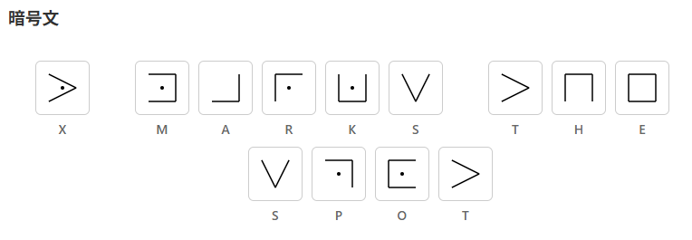

# Pigpen CipherLab - ピッグペン暗号ビジュアル学習ツール


**Day032 - 生成AIで作るセキュリティツール100**

**Pigpen CipherLab** は、古典的な図形暗号であるピッグペン暗号を「見て・触って・学べる」Webツールです。

3つのタブ（暗号化・復号・座学）により、直感的かつ視覚的に理解を深められます。

---

## 🌐 デモページ

👉 [https://ipusiron.github.io/pigpen-cipherlab/](https://ipusiron.github.io/pigpen-cipherlab/)

---

## 📸 スクリーンショット

> 
>
> *"hello world."の暗号文*

---

## 🔧 主な機能

### 📱 タブ機能

| 機能タブ | 内容 |
|--------|------|
| 🔐 暗号化タブ | 英文をピッグペン暗号の図形へ変換（リアルタイム表示・文字ハイライト付き） |
| 🔓 復号タブ | 図形（グリフ）をクリックして英文字へ復元、コピー機能付き |
| 📘 座学タブ | 暗号の背景・歴史・構造・解読技術を段階的に学習 |

### 🔐 暗号化タブの機能

- **リアルタイム暗号化**: 入力と同時に自動でグリフに変換
- **換字表表示**: アルファベットとグリフの対応を視覚的に表示
- **文字ハイライト**: 使用中の文字を黄色、直近の文字を赤色でハイライト
- **空白処理設定**: 空白を無視するか保持するかを選択可能
- **グリフセット選択**: 3種類の異なるピッグペン暗号パターンを選択
- **警告表示**: 英字以外の文字入力時に適切な警告を表示

### 🔓 復号タブの機能

- **グリフクリック入力**: 各グリフをクリックして対応する文字を入力
- **文字ラベル表示**: 各グリフの下に対応するアルファベットを表示
- **空白入力**: 専用の「空白」ボタンでスペースを挿入
- **文字削除**: 「DEL」ボタンで末尾の文字を削除
- **結果コピー**: ワンクリックで復号結果をクリップボードにコピー
- **トースト通知**: コピー完了時にアニメーション付きで通知
- **結果リセット**: 復号結果を一括でクリア

### 📘 座学タブの機能

- **学習1: 概要**: ピッグペン暗号の歴史と基本概念を学習
- **学習2: 換字表の読み方**: 
  - 3×3グリッドとX字グリッドの構造理解
  - 各位置とグリフ形状の対応関係の詳細解説
  - ドットの有無による文字区別の仕組み
  - 実際の使用例（HELLO等）で理解を深化
- **学習3: 暗号解読のTIPS**: 
  - 単一換字式暗号としての解読アプローチ
  - 頻度分析の活用方法
  - パターン認識のコツ
  - 具体的な解読手順とテクニック
  - 英語の文字頻度データの提供

### 🛠 共通機能

- **グリフセット切り替え**: 3種類の暗号パターンをタブ間で同期
- **レスポンシブデザイン**: スマートフォンやタブレットにも対応
- **ヘルプモーダル**: 「❓」ボタンから詳細な使い方を確認
- **キーボードショートカット**: ESCキーでモーダルを閉じる
- **アクセシビリティ**: スクリーンリーダー対応のalt属性とaria-label

---

## 🧠 ピッグペン暗号とは？

**ピッグペン暗号（Pigpen Cipher）** は、アルファベットを特殊な記号（三目並べのようなマス目から取った記号）に置き換える単一換字暗号です。

呼び名は「ビックペン」ではなく、「ピッグペン」です。

秘密結社フリーメイソンが18世紀に団員相互間の秘密通信や議事録の記録に使用されていたといわれており、フリーメイソンの暗号とも呼ばれます。
また、秘密結社バラ十字会員の暗号（Rosicrucian Cipher）と呼ばれるものも、ピッグペン暗号になります。

暗号文に現れる記号（グリフと呼ぶことにする）は、幾何学的・神秘的・奇妙であるため、特別なデザインに過ぎないと見落とされることがあり、暗号文と気づかないことがあります。

### 多彩なバリエーション

亜種がいろいろあります。

- 暗号文文字であるグリフの違い
- 換字表における、アルファベットの並びの違い

本ツールには3つのグリフパターンを用意しました。

| パターン | 特徴 | 出典 |
|-----------|-------------------------------------|--------|
| 換字表1 | 3×3⇒ドットつき3×3⇒X字⇒ドットつきX字 | [WikipediaのPigpen Cipher記事](https://en.wikipedia.org/wiki/Pigpen_cipher) |
| 換字表2 | 3×3⇒X字⇒ドットつき3×3⇒ドットつきX字 |『暗号解読 実践ガイド』P.438 |
| 換字表3 | 文字を囲んでいる直線の形と、その枠内の左から数えた順位をドットとする | 『暗号の秘密』P.62 |

### 暗号学的な安全性強度

ピッグペン暗号は単一換字式暗号であり、平文文字1文字が暗号文文字1文字に対応しています。
つまり、換字表（置換表）は1つです。

| 　        | 対象とする文字体系                    | 文字数 |
|-----------|-------------------------------------|--------|
| 平文文字   | アルファベット                       | 1文字  |
| 暗号文文字 | グリフ（マス目と点の組み合わせの幾何学的な記号） | 1文字  |

---

## 暗号化の例

"X marks the spot"という英文を換字表1で暗号化すると、以下のようになります。

> 
>
> *"X marks the spot"の暗号文*

この英文は、英語の[WikipediaのPigpen Cipher記事](https://en.wikipedia.org/wiki/Pigpen_cipher)でも紹介されているものであり、暗号文が一致することを確認できます。

---

## ピッグペン暗号文の解読アプローチ

1: ピッグペン暗号文に登場する記号を抽出して、リスト化する。
それと同時に各記号の登場数をカウントしておく。

2：リスト内の記号をそれぞれ、順にアルファベットを割り当てる。
これは、暗号文文字がアルファベット1文字である単一換字式暗号に相当する。

3：単純な単一換字式暗号文であるため、推測、辞書攻撃、頻度分析が有効になる。

---

## 📁 フォルダー構成

```
pigpen-cipherlab/
├── index.html          # メインHTMLファイル（3つのタブUI）
├── style.css           # スタイルシート（レスポンシブデザイン）
├── script.js           # JavaScript（タブ切替・暗号化・復号処理）
├── CLAUDE.md           # プロジェクトガイダンス（Claude Code用）
├── LICENSE             # MITライセンス
├── README.md           # プロジェクト説明
└── assets/
    ├── screenshot.png  # デモ用スクリーンショット
    └── glyphs/         # ピッグペン暗号のグリフファイル
        ├── 1/          # グリフセット1（Wikipediaパターン）
        │   ├── A.svg～Z.svg    # 各文字のSVGグリフ
        │   └── key_mapping.svg # 換字表の説明図
        ├── 2/          # グリフセット2（別パターン）
        │   ├── A.svg～Z.svg
        │   └── key_mapping.svg
        └── 3/          # グリフセット3（別パターン）
            ├── A.svg～Z.svg
            └── key_mapping.svg
```

---

## 私が関与したもの参考文献等

### 書籍

- [『暗号解読 実践ガイド』](https://akademeia.info/?page_id=39995)
    - P.34 NSAのマグカップに印字されたピッグペン暗号文
	- P.34-35 ニューヨーク墓碑のピッグペン暗号文
    - P.83 Andre Langieが解読したピッグペン暗号文
    - P.438 索引にバリエーションの1つが紹介されている。本ツールの換字表2に相当。

### ツール

- [ヒルクライミング法による単一換字式暗号の解読ツール](https://github.com/ipusiron/cipherclimb)

---

## 📄 ライセンス

MIT License - 詳細は [LICENSE](LICENSE) をご覧ください。

---

## 🛠 このツールについて

本ツールは、「生成AIで作るセキュリティツール100」プロジェクトの一環として開発されました。 このプロジェクトでは、AIの支援を活用しながら、セキュリティに関連するさまざまなツールを100日間にわたり制作・公開していく取り組みを行っています。

プロジェクトの詳細や他のツールについては、以下のページをご覧ください。

🔗 [https://akademeia.info/?page_id=42163](https://akademeia.info/?page_id=42163)
