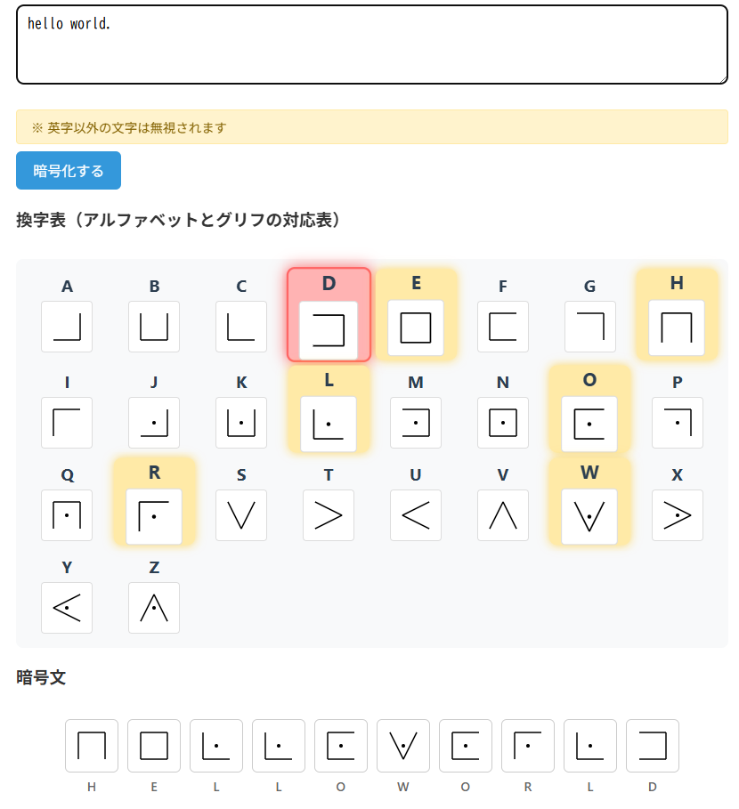

# Pigpen CipherLab - ピッグペン暗号ビジュアル学習ツール


**Day032 - 生成AIで作るセキュリティツール100**

**Pigpen CipherLab** は、古典的な図形暗号であるピッグペン暗号を「見て・触って・学べる」Webツールです。
3つのタブ（暗号化・復号・座学）により、直感的かつ視覚的に理解を深められます。

---

## 🌐 デモページ

👉 [https://ipusiron.github.io/pigpen-cipherlab/](https://ipusiron.github.io/pigpen-cipherlab/)

---

## 📸 スクリーンショット

> 
>
> *ダミー*

---

## 🔧 主な機能

| 機能タブ | 内容 |
|--------|------|
| 🔐 暗号化タブ | 英文をピッグペン暗号の図形へ変換（リアルタイム表示・グリフ付き） |
| 🔓 復号タブ | 図形（ピクトグラム）をクリックし、英文字へ復元 |
| 📘 座学タブ | 暗号の背景・歴史・構造・活用事例を図解付きで解説 |

---

## 🧠 ピッグペン暗号とは？

**ピッグペン暗号（Pigpen Cipher）** は、アルファベットを特殊な記号（三目並べのようなマス目から取った記号）に置き換える単一換字暗号です。

呼び名は「ビックペン」ではなく、「ピッグペン」です。

秘密結社フリーメイソンが18世紀に団員相互間の秘密通信や議事録の記録に使用されていたといわれており、フリーメイソンの暗号とも呼ばれます。
また、秘密結社バラ十字会員の暗号（Rosicrucian Cipher）と呼ばれるものも、ピッグペン暗号になります。

暗号文に現れる記号（グリフと呼ぶことにする）は、幾何学的・神秘的・奇妙であるため、特別なデザインに過ぎないと見落とされることがあり、暗号文と気づかないことがあります。

### 多彩なバリエーション

亜種がいろいろあります。

- 暗号文文字であるグリフの違い
- 換字表における、アルファベットの並びの違い

#### パターン1

文字を囲む直線の形と、その枠内の左から数えた順位を点で示したもので表わしたものです。

#### パターン2


#### パターン3

### 暗号学的な安全性強度

ピッグペン暗号は単一換字式暗号であり、平文文字1文字が暗号文文字1文字に対応しています。
つまり、換字表（置換表）は1つです。

| 　        | 対象とする文字体系                    | 文字数 |
|-----------|-------------------------------------|--------|
| 平文文字   | アルファベット                       | 1文字  | 
| 暗号文文字 | グリフ（マス目と点の組み合わせの幾何学的な記号） | 1文字  | 

---

## ピッグペン暗号文の解読アプローチ

1: ピッグペン暗号文に登場する記号を抽出して、リスト化する。
それと同時に各記号の登場数をカウントしておく。

2：リスト内の記号をそれぞれ、順にアルファベットを割り当てる。
これは、暗号文文字がアルファベット1文字である単一換字式暗号に相当する。

3：単純な単一換字式暗号文であるため、推測、辞書攻撃、頻度分析が有効になる。

---

## 📁 フォルダー構成

```
pigpen-cipherlab/
├── index.html
├── style.css
├── script.js
├── assets/
│ └── glyphs/ # ピッグペン記号の画像やSVGなど
└── README.md
```

---

## 📄 ライセンス

MIT License - 詳細は [LICENSE](LICENSE) をご覧ください。

---

## 🛠 このツールについて

本ツールは、「生成AIで作るセキュリティツール100」プロジェクトの一環として開発されました。 このプロジェクトでは、AIの支援を活用しながら、セキュリティに関連するさまざまなツールを100日間にわたり制作・公開していく取り組みを行っています。

プロジェクトの詳細や他のツールについては、以下のページをご覧ください。

🔗 [https://akademeia.info/?page_id=42163](https://akademeia.info/?page_id=42163)
