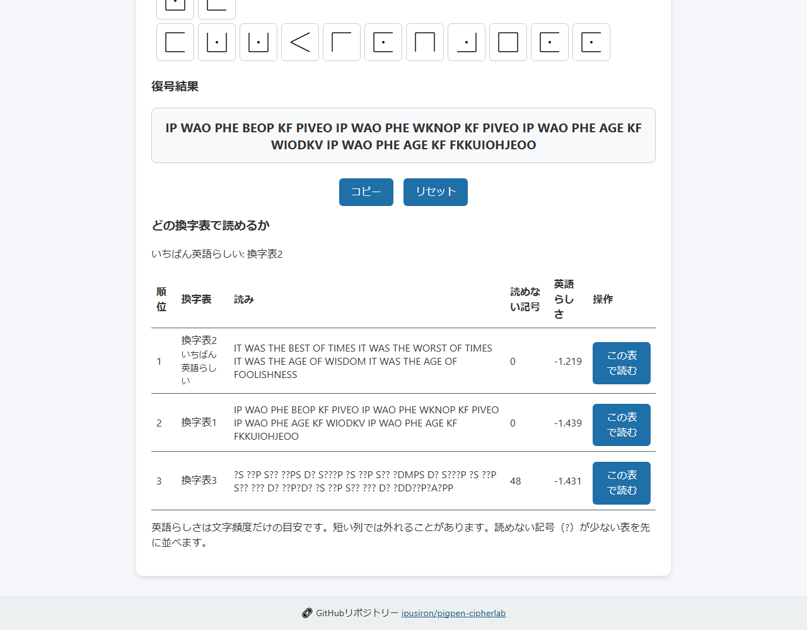
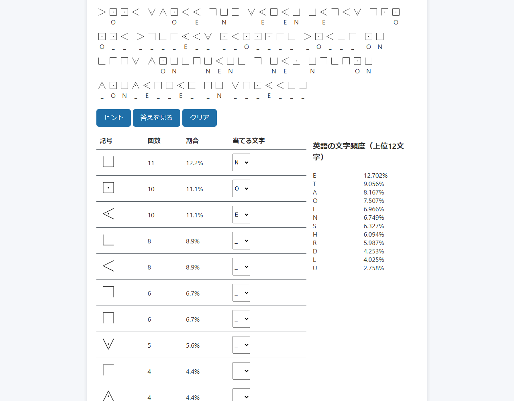
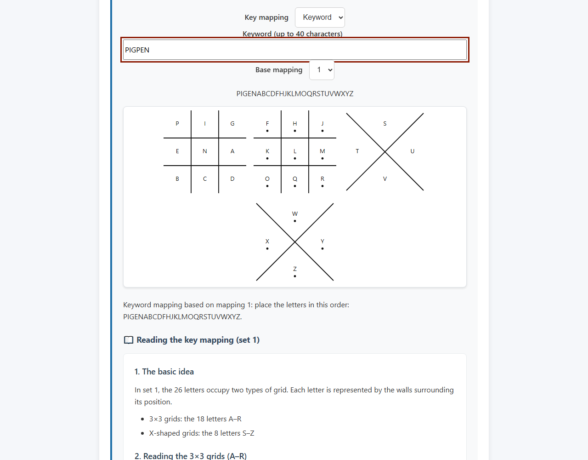

<!--
---
id: day032
slug: pigpen-cipherlab

title: "Pigpen CipherLab"

subtitle_ja: "ピッグペン暗号ビジュアル学習ツール"
subtitle_en: "Visual Learning Tool for Pigpen Cipher"

description_ja: "ピッグペン暗号を「見て・触って・学べる」Webツール。暗号化・復号・座学・解読演習の4タブで、キーワード換字表、変種の推定、頻度分析を体験できます。"
description_en: "Explore the Pigpen cipher through four tabs: encryption, decryption, learning, and exercises. Compare variants, build keyword mappings, and solve substitutions using frequency analysis."

category_ja:
  - 古典暗号
  - 換字式暗号
category_en:
  - Classical Cryptography
  - Substitution Cipher

difficulty: 1

tags:
  - pigpen-cipher
  - classical-cipher
  - cryptography
  - visualization
  - education
  - freemason-cipher

repo_url: "https://github.com/ipusiron/pigpen-cipherlab"
demo_url: "https://ipusiron.github.io/pigpen-cipherlab/"

hub: true
---
-->

[English](README.en.md) · 日本語

# Pigpen CipherLab - ピッグペン暗号ビジュアル学習ツール
[](https://ipusiron.github.io/pigpen-cipherlab/)


**Day032 - 生成AIで作るセキュリティツール100**

**Pigpen CipherLab** は、古典的な図形暗号であるピッグペン暗号を「見て・触って・学べる」Webツールです。

4つのタブ（暗号化・復号・座学・解読演習）により、直感的かつ視覚的に理解を深められます。

---

## 🌐 デモページ

👉 [https://ipusiron.github.io/pigpen-cipherlab/](https://ipusiron.github.io/pigpen-cipherlab/)

---

## 📸 スクリーンショット

> 
>
> *日本語の暗号化タブ。換字表1で空白を保持し、hello world.を入力。対応表のハイライトと2つの注意書き。1280×1000、46,097バイト。*


*換字表1で入力したHELLO WORLDの記号列を換字表2で読み直し、HEPPS WSVPDを表示。1280×1000、52,682バイト。*



*形だけのキーでサンプル②を読み込み、換字表2が1位の推定結果。1280×1000、64,775バイト。*



*lincolnの問題でヒントを3回使用。暗号文の下の文字と頻度表。1280×1000、40,872バイト。*


*英語の座学タブ。学習2の換字表1とモデル描画の記号つきの読み方。1280×1000、65,810バイト。*



*英語の座学タブ。PIGPEN・基1の図と説明。1280×1000、45,695バイト。*

---

## ✨ 機能

- **変種の推定**: 形だけの43キーで記号を入力し、3つの換字表と設定済みのキーワード表を英語らしさで比較
- **キーワード換字表**: 最大40文字のキーワードと基にする表から文字の並びを作成し、暗号化・復号・座学で同期
- **解読演習**: 英文5本をランダムな単一換字で出題し、記号の頻度から文字を推測
- **モデルからの描画**: 記号IDからSVGの線と点を描画。個別の記号画像を読み込まない

### 📱 タブ機能

| 機能タブ | 内容 |
|--------|------|
| 🔐 暗号化タブ | 英文をピッグペン暗号の図形へ変換（リアルタイム表示・文字ハイライト付き） |
| 🔓 復号タブ | 記号列を入力し、選んだ換字表で読み直す。コピー機能付き |
| 📘 座学タブ | 暗号の背景・歴史・構造・解読技術を段階的に学習 |
| 🧩 解読演習タブ | 記号の頻度を見て文字を当てる。ヒント・答え・クリア・新しい問題 |

### 🔐 暗号化タブの機能

- **リアルタイム暗号化**: 入力と同時に自動でグリフに変換
- **換字表表示**: アルファベットとグリフの対応を視覚的に表示
- **文字ハイライト**: 使用中の文字を黄色、直近の文字を赤色でハイライト
- **空白処理設定**: 空白を無視するか保持するかを選択可能
- **グリフセット選択**: 3種類の異なるピッグペン暗号パターンを選択
- **警告表示**: 英字以外の文字入力時に適切な警告を表示

### 🔓 復号タブの機能

- **グリフクリック入力**: 各グリフのボタンをクリックまたはキーボードで操作し、記号IDを入力
- **文字ラベル表示**: 各グリフの下に対応するアルファベットを表示
- **空白入力**: 専用の「空白」ボタンでスペースを挿入
- **文字削除**: 「DEL」ボタンで末尾の記号を削除
- **結果コピー**: ワンクリックで復号結果をクリップボードにコピー
- **トースト通知**: コピーの成功・失敗を画面と読み上げ領域で通知
- **結果リセット**: 復号結果を一括でクリア

### 📘 座学タブの機能

- **学習1. 概要**: ピッグペン暗号の歴史と基本概念を学習
- **学習2: 換字表の読み方**: 
  - 3×3グリッドとX字グリッドの構造理解
  - 各位置とグリフ形状の対応関係の詳細解説
  - ドットの有無による文字区別の仕組み
  - 実際の使用例（HELLO等）で理解を深化
- **学習3: 暗号解読のTIPS**: 
  - 単一換字式暗号としての解読アプローチ
  - 頻度分析の活用方法
  - パターン認識のコツ
  - 具体的な解読手順とテクニック
  - 英語の文字頻度データの提供

### 🛠 共通機能

- **グリフセット切り替え**: 3種類の換字表を3タブで同期し、暗号文・対応表・復号のキーと読み・座学の図を一括更新
- **レスポンシブデザイン**: スマートフォンやタブレットにも対応
- **ヘルプモーダル**: 「❓」ボタンから詳細な使い方を確認
- **キーボードショートカット**: ESCキーでモーダルを閉じる
- **アクセシビリティ**: タブのARIA属性・左右キー操作、記号キーのボタン、結果の読み上げ領域、ヘルプのフォーカス管理

---

## 📖 使い方

1. 暗号化タブで換字表を選び、hello world.を入力する。
2. 空白の「保持」を選び、対応表のハイライトと注意書き、暗号文を確認する。
3. 復号タブで換字表1のキーからHELLO WORLDを入力し、換字表2へ切り替える。同じ記号列の読みがHEPPS WSVPDになる。
4. 座学タブで各換字表の図と注記を読む。
5. 換字表で「キーワード」を選び、キーワードと基にする表を設定する。3タブの設定と並びは同期する。
6. 復号で「形だけ（全43種）」またはサンプルを選ぶ。「どの換字表で読めるか」の一覧で比較し、「この表で読む」で読み直す。
7. 解読演習で出典を選び「新しい問題」を押す。頻度表のセレクトで文字を当て、必要ならヒントを使う。

ヒントは、正しくない記号のうち出現回数が最も多いものを1つ埋めます。
同じ文字を複数の記号に当てると案内が出ます。正解すると出典と「解けました」を表示し、答えを見た場合は「答えを表示しました」と区別します。
「クリア」は当て方を消し、「新しい問題」は当て方を消して新しい換字表で出題します。
出題には`crypto.getRandomValues`を使い、利用できない場合は案内を表示して出題しません。

入力と同時に変換するため、「暗号化する」ボタンはありません。空白だけの入力もその設定に従って処理します。
換字表を変えても復号の記号列は保持され、その表にない記号は?で表示します。
空白・DEL・コピー・リセットはキーボードでも操作できます。ヘルプはTabが内部を循環し、Escまたは背景で閉じます。

ヘッダーの言語ボタンで日本語と英語を切り替えられます。優先順位はURLの`?lang=ja|en`、保存値、ブラウザーの言語です。
言語を切り替えてもタブ・換字表・空白処理・入力・記号列は変わりません。
`index.html`を直接開くfile://でも、ローカルHTTP配信でも動作します。

---

## 🧠 ピッグペン暗号とは？

**ピッグペン暗号（Pigpen Cipher）** は、アルファベットを特殊な記号（三目並べのようなマス目から取った記号）に置き換える単一換字式暗号です。

"Pigpen"は英語で「豚小屋」を意味し、この暗号がそう呼ばれる由来は、暗号の記号を作るために使用される3×3のマス目（グリッド）が豚を閉じ込める囲いの形に似ているためです。三目並べ（tic-tac-toe）のような格子模様が豚の囲いを連想させることから、この名前が付けられました。

"Pigpen"は「ピッグペン」と読みます（pig＝豚、pen＝囲い）。

### フリーメイソンの暗号とも呼ばれる

秘密結社フリーメイソンが18世紀初めから団員相互間の秘密通信や議事録の記録に使用していたといわれており、フリーメイソンの暗号とも呼ばれます。
また、秘密結社バラ十字会員の暗号（Rosicrucian Cipher）と呼ばれるものも、ピッグペン暗号になります。
Wikipediaが紹介する方式は点の位置（左・中・右）で区別し、本ツールの換字表3は点の数（1〜3）で区別します。

暗号文に現れる記号（本ツールではグリフと呼びます）は、幾何学的・神秘的・奇妙であるため、特別なデザインに過ぎないと見落とされることがあり、暗号文と気づかないことがあります。

### 多彩なバリエーション

亜種がいろいろあります。

- 暗号文文字であるグリフの違い
- 換字表における、アルファベットの並びの違い

本ツールには3つのグリフパターンを用意しました。

| パターン | 特徴 | 出典 |
|-----------|-------------------------------------|--------|
| 換字表1 | 3×3⇒ドットつき3×3⇒X字⇒ドットつきX字 | [WikipediaのPigpen Cipher記事](https://en.wikipedia.org/wiki/Pigpen_cipher) |
| 換字表2 | 3×3⇒X字⇒ドットつき3×3⇒ドットつきX字 |『暗号解読 実践ガイド』P.438 |
| 換字表3 | 9マスに3文字ずつ配置し、点の数（1〜3）で区別 | 『暗号の秘密』P.62 |

### 暗号学的な安全性強度

ピッグペン暗号は単一換字式暗号であり、平文文字1文字が暗号文文字1文字に対応しています。
つまり、換字表（置換表）は1つです。

| 　        | 対象とする文字体系                    | 文字数 |
|-----------|-------------------------------------|--------|
| 平文文字   | アルファベット                       | 1文字  |
| 暗号文文字 | グリフ（マス目と点の組み合わせの幾何学的な記号） | 1文字  |

---

## 🔬 仕様と既知解答

記号IDは`g:<壁>:<点の数>`または`x:<区画>:<点の数>`です。
井桁の壁は上T・右R・下B・左Lの順、X字の区画は上T・左L・右R・下Bです。
たとえば`g:RB:0`は右と下に壁がある点なしの記号、`x:T:0`は上の区画（Vの字の形）です。

入力はNFKD正規化で全角英字を半角にし、アクセント記号を外して大文字にします。
全角のhelloはHELLO、straßeはSTRASSE、caféはCAFEになります。
保持モードでは改行を行の区切りとし、タブ・全角スペース・NBSPなどは空白にします。無視モードではすべての空白を除きます。
英字と空白以外は無視し、その件数を注意書きに表示します。存在しない画像への要求は作りません。

| 換字表 | 平文 | 記号ID |
|---|---|---|
| 1 | `X marks the spot` | `X=x:L:1 M=g:TRB:1 A=g:RB:0 R=g:TL:1 K=g:RBL:1 S=x:T:0 T=x:L:0 H=g:TRL:0 E=g:TRBL:0 S=x:T:0 P=g:TR:1 O=g:TBL:1 T=x:L:0` |
| 1 | `HELLO` | `H=g:TRL:0 E=g:TRBL:0 L=g:BL:1 L=g:BL:1 O=g:TBL:1` |
| 2 | `HELLO` | `H=g:TRL:0 E=g:TRBL:0 L=x:R:0 L=x:R:0 O=g:RBL:1` |
| 3 | `HELLO` | `H=g:BL:2 E=g:RBL:2 L=g:TRB:3 L=g:TRB:3 O=g:TRBL:3` |

3表はそれぞれ異なる26個の記号を持ち、グリフは合計78枚です。
換字表1と2は同じ26個の記号の並べ替えです。同じHELLO WORLDの記号列でも、表1で作って表2で読むとHEPPS WSVPDになります。
表3の記号のうち表1にもあるものは9個です。表1の同じ列を表3で読むと??GGP ?PYG?になります。

---

キーワード表は、キーワードの英字を正規化して重複を除き、残りの英字をA〜Zの順で続けます。
この並びを基の換字表の置き場所へ順に入れます。空のキーワードは通常の並びです。

| キーワード | 基 | 並び | HELLO の記号 ID |
|---|---|---|---|
| PIGPEN | 1 | PIGENABCDFHJKLMOQRSTUVWXYZ | H=g:RBL:1 E=g:TRB:0 L=g:TRBL:1 L=g:TRBL:1 O=g:TR:1 |
| KRYPTOS | 3 | KRYPTOSABCDEFGHIJLMNQUVWXZ | H=g:TRBL:3 E=g:TRB:3 L=g:TBL:3 L=g:TBL:3 O=g:RBL:3 |

変種の推定は、読めない記号の数が少ない順、読めた文字の英語頻度のlog10平均が高い順に並べます。
文字頻度だけの目安なので、短い列では外れることがあります。単語の意味を判定するものではありません。

| 記号列 | 1位 | 読み |
|---|---|---|
| HELLO WORLD / 1 | 1 | HELLO WORLD |
| HELLO WORLD / 2 | 2 | HELLO WORLD |
| HELLO WORLD / 3 | 3 | HELLO WORLD |

全表の記号の和集合は43種です。100×100の枠で線と点を描き、描画データが既存SVG78枚の線・点と一致することをテストで確かめます。

---

## 🧩 解読演習の英文

次の5本は著作権の保護期間が終わった公有の文です。文字数は出題に使う英字の数です。
本文はREADMEには掲載しません。出題の換字は毎回変わり、入力や当て方は保存・送信しません。

| 出典 | 文字数 |
|---|---|
| Charles Dickens, A Tale of Two Cities (1859) | 82 |
| Herman Melville, Moby-Dick (1851) | 80 |
| Jane Austen, Pride and Prejudice (1813) | 92 |
| Declaration of Independence (1776) | 117 |
| Abraham Lincoln, Gettysburg Address (1863) | 90 |

---

## 🔤 暗号化の例


"X marks the spot"という英文を換字表1で暗号化すると、以下のようになります。

> 
>
> *"X marks the spot"の暗号文*

この英文は、英語の[WikipediaのPigpen Cipher記事](https://en.wikipedia.org/wiki/Pigpen_cipher)でも紹介されているものであり、暗号文が一致することを確認できます。

---

## 🔍 ピッグペン暗号文の解読アプローチ

1: ピッグペン暗号文に登場する記号を抽出して、リスト化する。
それと同時に各記号の登場数をカウントしておく。

2. リスト内の記号をそれぞれ、順にアルファベットを割り当てる。
これは、暗号文文字がアルファベット1文字である単一換字式暗号に相当する。

3. 単純な単一換字式暗号文であるため、推測、辞書攻撃、頻度分析が有効になる。

---

## 📚 参考リソース

### 書籍（私が関与したもの）

- [『暗号解読 実践ガイド』](https://akademeia.info/?page_id=39995)
    - P.34 NSAのマグカップに印字されたピッグペン暗号文
    - P.34-35 ニューヨーク墓碑のピッグペン暗号文
    - P.83 Andre Langieが解読したピッグペン暗号文
    - P.438 索引にバリエーションの1つが紹介されている。本ツールの換字表2に相当。

### ツール（自作）

- [ヒルクライミング法による単一換字式暗号の解読ツール](https://github.com/ipusiron/cipherclimb)

---

## 🔒 このツールのセキュリティ

CSPはスクリプトとスタイルを同一配信元だけに制限し、インライン処理を許可しません。
画面の内容はDOMとtextContentで構築し、入力をHTMLとして扱いません。外部API・CDN・フォント・依存ライブラリを使わず、操作中の外部通信はありません。
外部リンクは利用者が選んだときだけ開きます。localStorageには言語（`pigpen-language`）だけを保存し、保存できなくても使えます。
暗号文や平文は保存・送信しません。ピッグペン暗号自体は学習用で、秘密情報の保護には使わないでください。

---

## 🧪 テスト

Node.js 22で`npm test`を実行します。依存のインストールは不要です。
GitHub Actionsもpushとpull_requestで同じテストを実行します。

| ファイル | 検査内容 |
|---|---|
| core.test.js | 3表の記号ID、入力正規化、暗号化、読み直し、SVG78枚の線・点 |
| core2.test.js | 描画座標、キーワード換字表、変種の推定、解読演習の既知解答 |
| html.test.js | CSP・ARIA・ラベル・禁止するDOM操作 |
| i18n.test.js | 日英のキーと補間値、日本語リテラルの残り |
| contrast.test.js | CSS変数の10組が4.5:1以上 |
| format.test.js | 最長行と行数の下限 |
| readme.test.js | 既知解答・キーワード・推定の再計算、出典5本、日英16節、ツリーと画像6枚、YAML |

---

## 📁 ディレクトリー構造

```text
pigpen-cipherlab/                 # プロジェクトのルート
├── .github/                      # GitHub の設定
│   └── workflows/                # GitHub Actions のワークフロー
│       └── test.yml              # push と pull_request で npm test を実行する
├── assets/                       # 画像
│   ├── en/                       # 英語の画面のスクリーンショット
│   │   ├── screenshot.png        # 英語の座学タブ（換字表1の読み方）
│   │   └── screenshot2.png       # 英語の座学タブ（PIGPEN・基1）
│   ├── glyphs/                   # 記号の画像（換字表ごと）
│   │   ├── 1/                    # 換字表1（Wikipedia の配置）
│   │   │   ├── A.svg〜Z.svg      # 各文字の記号（26ファイル）
│   │   │   └── key_mapping.svg   # 換字表の図
│   │   ├── 2/                    # 換字表2（『暗号解読 実践ガイド』P.438）
│   │   │   ├── A.svg〜Z.svg      # 各文字の記号（26ファイル）
│   │   │   └── key_mapping.svg   # 換字表の図
│   │   └── 3/                    # 換字表3（『暗号の秘密』P.62）
│   │       ├── A.svg〜Z.svg      # 各文字の記号（26ファイル）
│   │       └── key_mapping.svg   # 換字表の図
│   ├── ciphertext.png            # README の暗号化の例（X marks the spot）
│   ├── screenshot.png            # 暗号化タブ（hello world.）
│   ├── screenshot2.png           # 復号タブ（同じ記号列を換字表2で読む）
│   ├── screenshot3.png           # 変種の推定（サンプル②）
│   └── screenshot4.png           # 解読演習（lincoln・ヒント3回）
├── js/                           # 画面から分けたスクリプト
│   ├── i18n.js                   # 日英の辞書と言語の切り替え
│   └── pigpen-core.js            # 記号のモデル・入力の正規化・暗号化・読み直し（DOM を使わない）
├── test/                         # 自動テスト（node --test）
│   ├── contrast.test.js          # 配色のコントラスト比
│   ├── core.test.js              # 中核の期待値とグリフ78枚の形
│   ├── core2.test.js             # 拡張中核の期待値と描画座標78件
│   ├── format.test.js            # 最長行と行数の下限
│   ├── html.test.js              # CSP・ARIA・禁止する書き方
│   ├── i18n.test.js              # 日英の辞書のキーと日本語の直書き
│   └── readme.test.js            # README の既知解答・構成・画像
├── .gitignore                    # Git の管理から外すファイル
├── .nojekyll                     # GitHub Pages で Jekyll を使わない
├── CLAUDE.md                     # Claude Code 向けの説明
├── LICENSE                       # MIT ライセンス
├── README.en.md                  # 英語の説明
├── README.md                     # 日本語の説明
├── index.html                    # 4タブの画面
├── package.json                  # npm test の設定（依存なし）
├── script.js                     # 画面の処理（状態と描画）
└── style.css                     # スタイル
```

---

## 💻 動作環境

現行のChrome・Edge・Firefox・Safariなど、Unicode正規化とdialogに対応したブラウザーを想定しています。
HTTPとfile://の両方で動作します。コピーはClipboard APIが利用可能な場合に成功し、利用できない場合は画面に案内します。
今回の自動検証はPython版PlaywrightとChromiumです。実機のスマートフォンとほかのブラウザーは未検証です。

---

## 📄 ライセンス

MIT License - 詳細は [LICENSE](LICENSE) をご覧ください。

---

## 🛠️ このツールについて

本ツールは、「生成AIで作るセキュリティツール100」プロジェクトの一環として開発されました。 このプロジェクトでは、AIの支援を活用しながら、セキュリティに関連するさまざまなツールを100日間にわたり制作・公開していく取り組みを行っています。

プロジェクトの詳細や他のツールについては、以下のページをご覧ください。

🔗 [https://akademeia.info/?page_id=42163](https://akademeia.info/?page_id=42163)
